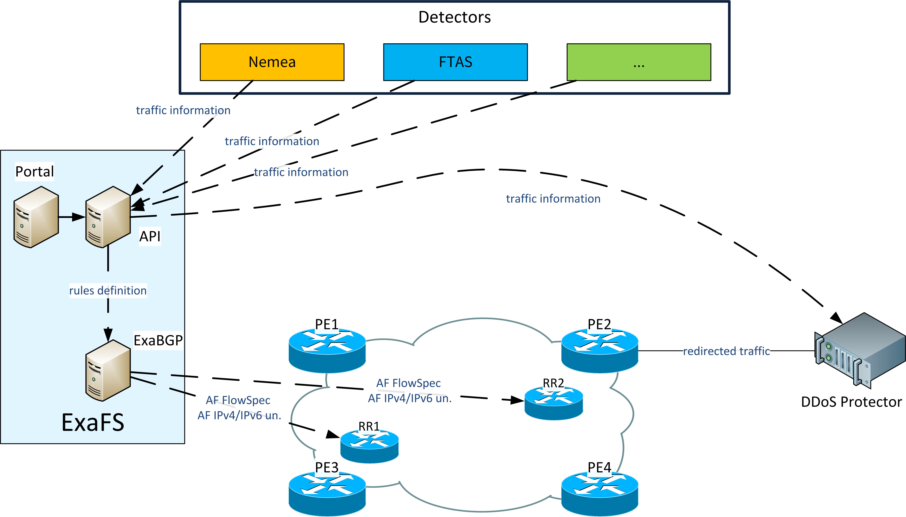

# ExaFS

ExaFS is a web layer for creation, validation, and execution of ExaBGP messages (https://github.com/Exa-Networks/exabgp).

ExaFS provides both the user Web interface and the REST API for web service. 

Key contributions of the system are **user authorization** mechanism and **validation system for BGP commands**.

Without ExaFS the system Root privileges are required for direct interaction with ExaBGP. ExaFS provides several user roles and access rights similarly to user roles in other software systems such as SQL. The user rights can be specified for various kind of sub-nets following the network topology. 

Validation system for BGP commands assures that only error-free messages are passed to the system BGP API. Both syntax and access rights are validated before a new rule is saved to the database. 

Thanks to the storage, all the rules can be restored quickly after a system reboot or failure. All rules are validated again, before sending them to ExaBPG from the storage, to prevent any malicious database manipulation.

ExaFS is an integral part of daily cybersecurity tools at CESNET. However, it can be used in any network where ExaBGP is available.

On the picture below, you can see as the ExaFS is integrated into the network. 

## Project presentations

* 2020 - CZ [DDoS Protector v prostředí propojovacího uzlu NIX.CZ](https://www.cesnet.cz/wp-content/uploads/2020/02/DDP_v_NIX.pdf), [Seminář o bezpečností sítí a služeb 2020](https://www.cesnet.cz/akce/bss20/)
* 2019 - EN [ExaFS: miঞgaঞng unwanted traffic](https://xn--ondej-kcb.caletka.cz/dl/slidy/20191113-SIGNOC-ExaFS.pdf), [10th SIG-NOC meeting](https://wiki.geant.org/display/SIGNOC/10th+SIG-NOC+meeting), Prague
* 2019 - CZ [Potlačení nežádoucího provozu pomocí BGP Flowspec](https://indico.csnog.eu/event/6/contributions/64/attachments/35/61/CESNET-FlowSpec-CSNOG.pdf), [CSNOG 2019](https://indico.csnog.eu/event/6/overview) 
* 2019 - CZ [Nástroje pro FlowSpec a RTBH](https://konference.cesnet.cz/prezentace2019/sal1/3_Adamec.pdf), [Konference e-infrastruktury CESNET](https://konference.cesnet.cz/) 2019
* 2019 - CZ [Nástroje pro obranu proti útokům na páteřních směrovačích](https://konference.cesnet.cz/prezentace2019/sal1/3_Verich.pdf),[Konference e-infrastruktury CESNET](https://konference.cesnet.cz/) 2019

## Main parts

The main part of the ExaFS is a web application, written in Python3.6 with Flask framework. It provides a user interface for ExaBGP rule CRUD operations. All rules are carefully validated and only valid rules are sent to the ExaBGP table.  This application also provides the REST API with CRUD operations for the configuration rules.

The web app creates the ExaBGP commands and forwards them to ExaAPI. This second part of the system is another web application that replicates the received command to the stdout. The ExaBGP daemon must be configured for monitoring stdout of ExaAPI. Every time this API gets a  command from ExaFS,  it replicates this command to the ExaBGP daemon through the stdout. The registered daemon then updates the ExaBGP table – create, modify or remove the rule from command.

Last part of the system is Guarda service. This systemctl service is running in the host system and is wanted by ExaBGP service.  That means for every restart of ExaBPG this service will start and again put the valid and active rules to Exa table. 

## DOCS
* [Install notes](./docs/INSTALL.md)
* [API documentation ](https://exafs.docs.apiary.io/#)
* [Database backup configuration](./docs/DB_BACKUP.md)
* [Local database instalation notes](./docs/DB_LOCAL.md)
